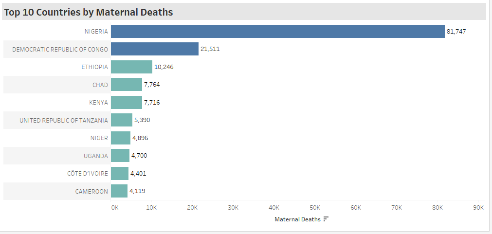
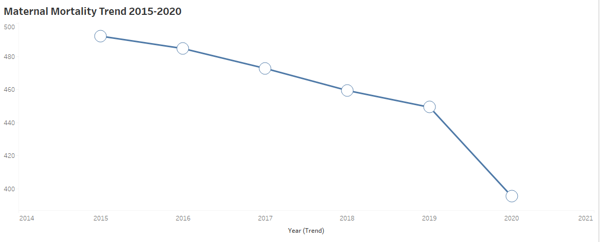
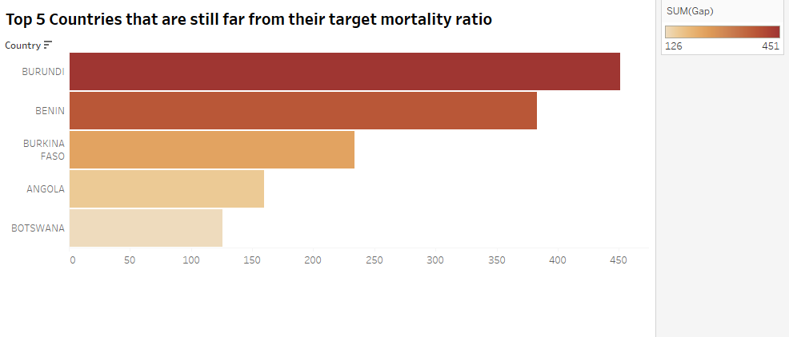
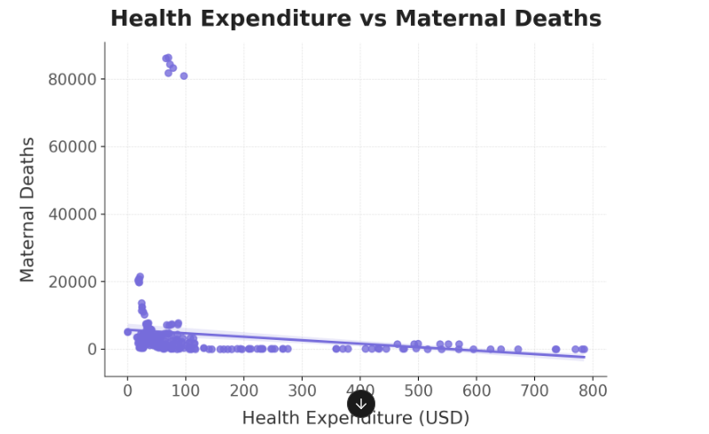

# INDEPTH ANALYSIS OF THE FACTORS AFFECTING MATERNAL HEALTH OUTCOMES


## 📌 MATERNAL MORTALITY TRENDS IN SUBSAHARAN COUNTRIES
Under this section i will analyse:  
- Top ten countries with highest maternal death
- Maternal Mortality trend over time 
- What countries met their target mortality ratio 
- What countries have the highest gaps between their maternal mortality ratio and target  
- Does access to skilled birth attendant reduce mortality?  
- Is healthcare expenditure linked to better health outcomes?
- Do more health facilities reduce maternal mortality ? 
- Is higher doctor density linked to lower mortality?
- Does poverty increase maternal mortality ?
- Does unemployment affect maternal mortality?
- What countries have high health investment but poor health outcomes?
- countries with fastest reduction in maternal deaths
✅
### 🚀 Top 10 countries with highest maternal deaths
```sql
SELECT 
    country,
    md_measure AS Maternal_deaths
FROM 
    maternal_deaths
WHERE
    year = '2020'
GROUP BY 
    country,
    Maternal_deaths
ORDER BY 
    Maternal_deaths DESC
LIMIT 10;
```


*A bar chart showing the top ten countries which highest maternal deaths*
## *Insights*
The trend suggests that certain regions might require targeted interventions to improve maternal healthcare due to large descrepancies in maternal deaths countries like Nigeria and Congo need special initiatives to lower the number of maternl deaths.

### 🚀 Maternal Mortality trend over time
```sql
SELECT 
    year, 
    ROUND(AVG(mm_measure),2) as avg_mm_ratio
FROM 
    maternal_mortality
GROUP BY 
    year
ORDER BY 
    year;
```

*Line chart showing the average trend of maternal deaths in Subsaharan countries 2015-2020*

## *Insights*
The average maternal mortality ratio has been consistently declining over the years, so despite some countries having large number of maternal deaths, this shows there are good initiatives in place in some countries that help to lower the maternal deaths.

### 🚀 What countries met their target mortality ratio
```sql
SELECT 
country, 
mm_measure AS Maternal_mortality, 
mm_target AS Mortality_target
FROM maternal_mortality
WHERE
mm_measure <= mm_target
ORDER BY
country, year
```

*Comparison barchart showing countries that reached their target mortality ratio*

## *Insights*
- Both Mozambique and Seychelles have successfully met their maternal mortality targets.
- Seychelles shows exceptional performance with a mortality rate 83.3% below target (3 vs 18).
- Mozambique is also performing positively, with a 7.3% margin below target (127 vs 137).
- The stark difference between these countries highlights significant healthcare disparities.
- Seychelles represents a high-performing healthcare system typical of higher-income nations.
- Mozambique shows progress but still faces challenges common in developing regions.

### 🚀 What countries have the highest gaps between their maternal mortality ratio and target
```sql
WITH ranked_gaps AS(
    SELECT DISTINCT ON (country) 
        country,
        year,
        (mm_measure - mm_target) AS GAP
    FROM 
        maternal_mortality
    ORDER BY
        country, GAP DESC
    LIMIT 5
)
SELECT
    country,
    year,
    GAP
FROM
    ranked_gaps
ORDER BY GAP DESC;
```


*Barchart showing top 5 countries that are still behind to reaching their target mortality ratio*

## *Insights*
- Burundi has the highest maternal mortality gap (451) as of 2015
- Benin follows with a gap of 383 (2020)
- The average gap across these countries is 270.8
- Possible Factors Contributing to the Gap
Ccould be Lack of healthcare accessibility or funding, High burden of disease (e.g., infectious diseases, maternal health issues), or Socioeconomic disparities impacting healthcare delivery.

## 📌RELATIOSHIP BETWEEN SOCIOECONOMIC, HEALTHCARE FACTORS AND MATERNAL HEALTH OUTCOMES

## 📌HEALTHCARE FACTORS
### 🚀Does access to skilled birth attendant reduce mortality?

```SQL
SELECT 
    maternal_mortality.country,
    maternal_mortality.year,
    maternal_mortality.mm_measure AS MM,
    birth_by_skilled.att_measure*100 AS Birth_by_skilled

FROM 
    maternal_mortality
JOIN 
    birth_by_skilled ON maternal_mortality.country= birth_by_skilled.country
    AND maternal_mortality.year = birth_by_skilled.year

ORDER BY mm_measure DESC
```
## *Insights*
- Based on the analysis, there's a negative correlation of -0.64 between maternal mortality ratio and birth attended by skilled personnel. This suggests that asthe percentage of births attended by skilled health personnel tends to decrease the maternal ration increased.

- There is inverse relationship clearly, with countries having higher maternal mortality ratio generally showing lower percentages of skilled birth rates.

### 🚀Is healthcare expenditure linked to better health outcomes
```SQL
SELECT
    maternal_deaths.country,
    maternal_deaths.year,
    md_measure AS m_deaths,
    health_expenditure.exp_measure AS "h_expenditure(usd)"
FROM
    maternal_deaths
JOIN 
    health_expenditure ON maternal_deaths.country = health_expenditure.country 
    AND maternal_deaths.year = health_expenditure.year
ORDER BY m_deaths DESC;
```


*Scatterplot showing if health expenditure affects maternal health outcome*
## *Insights*
- The analysis shows a weak negative correlation of -0.13 between health expenditure and maternal deaths, suggesting that as health expenditure increases, maternal deaths tend to decrease slightly, but the relationship isn't strong.
- Seems like it doesnt matter how much is spend but how committed and strong the initiative is in addressing maternal health problem.

### 🚀Do more health facilities reduce maternal mortality
```SQL
WITH expenditure_vs_mm AS (
    SELECT DISTINCT ON (country)
        maternal_deaths.country,
        maternal_deaths.md_measure AS m_deaths,
        health_facilities_count.facilities_count AS facilities_count
    FROM
        maternal_deaths
    JOIN 
        health_facilities_count ON maternal_deaths.country = health_facilities_count.country
    ORDER BY country
)
SELECT
    country,
    m_deaths,
    facilities_count
FROM expenditure_vs_mm
ORDER BY m_deaths DESC;
```
## *Insights*


### 🚀Is higher doctor density linked to lower mortality 
```SQL
WITH m_deaths_vs_doctors AS(
    SELECT
        maternal_deaths.country, 
        maternal_deaths.year,
        maternal_deaths.md_measure AS m_deaths,
        md_density.d_measure AS doctor_density
    FROM 
        maternal_deaths
    JOIN md_density 
    ON maternal_deaths.country = md_density.country AND maternal_deaths.year = md_density.year
    ORDER BY maternal_deaths.year DESC
)
SELECT
    country,
    m_deaths,
     doctor_density
FROM m_deaths_vs_doctors
ORDER BY m_deaths DESC;
```

## *Insights*


## 📌SOCIOECONOMIC FACTORS

### 🚀Does poverty increase maternal mortality ?

```SQL
WITH mm_poverty AS (
    SELECT 
    maternal_mortality.country, 
    maternal_mortality.year, 
    maternal_mortality.mm_measure, 
    poverty_rate.poverty_rate_avg
    FROM 
        maternal_mortality
    JOIN poverty_rate
    ON maternal_mortality.country = poverty_rate.country 
    AND maternal_mortality.year = poverty_rate.year
    ORDER BY maternal_mortality.year DESC
)
SELECT 
    country,
    year,
    mm_measure,
    poverty_rate_avg
FROM mm_poverty
ORDER BY mm_measure DESC;
```
## *Insights*


### 🚀 Does unemployment affect maternal mortality?
```SQL
SELECT 
    maternal_mortality.country, 
    maternal_mortality.year, 
    maternal_mortality.mm_measure, 
    unemployment_rate.unemployment_rate
FROM 
    maternal_mortality
JOIN unemployment_rate
ON maternal_mortality.country = unemployment_rate.country 
AND maternal_mortality.year = unemployment_rate.year
ORDER BY maternal_mortality.mm_measure DESC;
```

## *Insights*
