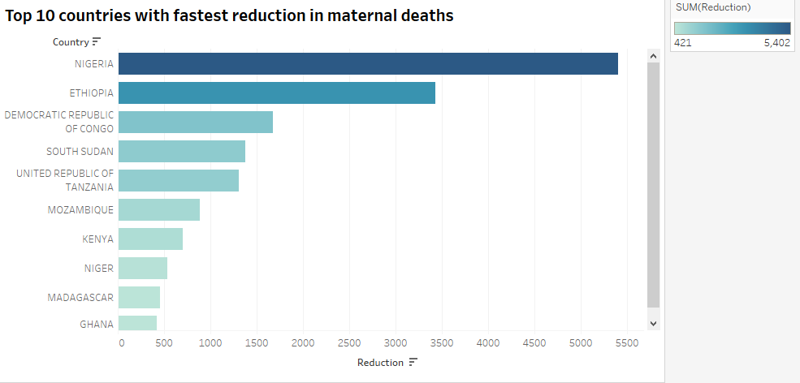

# **Maternal Mortality Analysis in Sub-Saharan Africa**  
### **A Data-Driven Approach to Understanding Maternal Health Outcomes**

## **📌 Project Overview**  
This project explores the factors influencing **maternal mortality** in **Sub-Saharan Africa**, using **SQL for data transformation and analysis** and **Tableau for interactive visualizations**.

**Checkout my indepth analysis here** : [Project_Analysis](/Project_sql/)

🚀 **The question that am trying to answer are:**  
✔️ What are key socioeconomic and healthcare factors affecting maternal health outcomes.  
✔️ What subsaharan countries have high maternal mortality**  
✔️ What is the trend of maternal mortality 2015-2020  
✔️ What countries are meeting their maternal mortality targets and what countries still have alot to do.


----
## 🛠Tools Used

**SQL**: For data cleaning, transformation, and analysis.  

**PostgreSQL**: The chosen database management system, ideal for handling the data.

**Visual Studio Code**: My go-to for database management and executing SQL queries.

**Tableau**: For creating interactive dashboards and visualizations.

**GitHub**: For version control and showcasing the project.

---
### **🚀 Skills Showcased**  
✅ **SQL:** Data Cleaning, Joins, Aggregations, Feature Engineering.  
✅ **Tableau:** KPI Dashboards, Dynamic Filters, Interactive Maps.  
✅ **Data Analysis:** Identifying patterns, correlations, and trends in maternal health data.
✅ **Problem solving skiils** At the end i provide my expert data driven opinion on how to improve maternal health outcomes

## **📊 Data Sources & Structure**  
The project is built using **9 datasets**, each representing critical maternal health indicators:  

| **Table Name**               | **Description** |
|------------------------------|------------------------------------------------|
| `maternal_mortality`         | Annual maternal mortality ratios per country  |
| `maternal_deaths`            | Total maternal deaths per year per country  |
| `birth_by_skilled`           | Percentage of births attended by skilled personnel  |
| `unemployment_rate`          | Annual unemployment rates per country  |
| `health_expenditure`         | Health expenditure as a percentage of GDP  |
| `poverty_rate`               | Percentage of population living below the poverty line  |
| `health_facilities_count`    | Total number of health facilities per country  |
| `sub_health_facilities`      | Subset of facilities in **Sub-Saharan Africa**  |
| `md_density`                 | Medical doctor density (doctors per 1,000 people)  |

**Key Challenge:** The datasets have **different year ranges** and **varying country name conventions**, which required **data cleaning and transformation** in SQL and Power Query.

 
---   

## **🛠 Data Transformation in SQL**  
### **Key SQL Steps:**
✔️ **Data Cleaning**: I did most of my data cleaning in power query, so i only added the index column 

```sql
--creating index on primary key for better perfomance 
CREATE INDEX Country_id ON maternal_deaths (Country);
``` 

✔️ **Data Joins**: Combined multiple tables using **INNER JOIN** and **LEFT JOIN** to merge key indicators.  


```sql
---Joining maternal mortality with all other contributing and socioeconomic factors*
SELECT 
    md.country,
    md.year,
    md.md_measure AS m_deaths,
    mm.mm_measure AS m_mortality,
    mm.mm_target as mortality_target,
    bp.att_measure AS skilled_birth_rate,
    ur.unemployment_rate AS unemploy_rate,
    he.exp_measure AS "health_exp(usd)",
    pr.poverty_rate_avg AS pov_rate,
    md_density.d_measure AS dr_density
FROM maternal_deaths md
LEFT JOIN maternal_mortality mm ON md.country = mm.country AND md.year = mm.year
LEFT JOIN birth_by_skilled bp ON md.country = bp.country AND md.year = bp.year
LEFT JOIN unemployment_rate ur ON md.country = ur.country AND md.year = ur.year
LEFT JOIN health_expenditure he ON md.country = he.country AND md.year = he.year
LEFT JOIN poverty_rate pr ON md.country = pr.country AND md.year = pr.year
LEFT JOIN md_density ON md.country = md_density.country AND md.year = md_density.year
ORDER BY md.country, md.year;
```


✔️ **Missing Data Handling**: Replaced null values with zero or interpolated missing years,For important missing values , data was inserted manually from other datasets due to datasets inconsistency
```sql
---ADDING DATA IN THE MATERNAL DEATHS DATA

INSERT INTO maternal_deaths (country, year, md_measure)
VALUES  ('ZIMBABWE', 2015, 2035),
        ('ZIMBABWE', 2016, 1960),
        ('ZIMBABWE', 2017, 1810),
        ('ZIMBABWE', 2018, 1700);
``` 


✔️ **Feature Engineering**: Created new columns, such as mortality gap which through Common Table Expression (CTE) i was able to identify the countries that have the largest gap between the maternal mortality ratio and the country's target  value 
  ```sql
  --what countries have the largest gap btn th MMR AND target

WITH ranked_gaps AS(
    SELECT DISTINCT ON (country) 
        country,
        year,
        (mm_measure - mm_target) AS GAP
    FROM 
        maternal_mortality
    ORDER BY
        country, GAP DESC
    LIMIT 5
)
SELECT
    country,
    year,
    GAP
FROM
    ranked_gaps
ORDER BY GAP DESC;
  ```
✔️ **Aggregation**: Computed average maternal mortality ratio by year which helped me to analyse the trend of maternal mortality ration over the course 2015-2020.

```sql
-- Maternal Mortality trend over time 

SELECT 
    year, 
    ROUND(AVG(mm_measure),2) as avg_mm_ratio
FROM 
    maternal_mortality
GROUP BY 
    year
ORDER BY 
    year;
```

## 🚀🚀🚀*sneak peek of my indepth analysis*

### 🚀countries with high health investment but poor health outcomes
```SQL
SELECT
    maternal_mortality.country,
    maternal_mortality.year,
    maternal_mortality.mm_measure,
    health_expenditure.exp_measure
FROM
    maternal_mortality
JOIN health_expenditure ON maternal_mortality.country = health_expenditure.country 
AND maternal_mortality.year = health_expenditure.year 
WHERE
mm_measure > 400 AND
exp_measure > 150
ORDER BY mm_measure DESC;
```

| Country  | Year | MM Measure | Expected Measure |
|----------|------|------------|------------------|
| ESWATINI | 2015 | 432        | 252.68           |

*Table showing maternal mortality ration and health expenditure of the respective country*
## *Insights*
- My custom filter showed that Eswatini was investing high expenditure health but still having high maternal mortality ratio.
- This should alarm the country to review their initiatives on improving maternal health oucomes

### 🚀countries with fastest reduction in maternal deaths
```sql
WITH mortality_change AS (
    SELECT country, 
           MAX(md_measure) - MIN(md_measure) AS reduction,
           MIN(year) AS start_year, MAX(year) AS end_year
    FROM maternal_deaths
    GROUP BY country
)
SELECT 
    country, 
    reduction, 
    start_year, 
    end_year
FROM 
    mortality_change
ORDER BY reduction DESC;
```

*Barchart showing which countries reduced their maternal deaths rapidly in five years time*

## *Insights*
- Nigeria Leads in Reduction. Nigeria had the highest reduction in absolute numbers (5,402) between 2015 and 2020. This suggests a significant effort in maternal health interventions or overall improvements in healthcare systems.Which is weird because if you look at my deep analyses you find that Nigeria is also the leading country with high maternal deaths, this shows despite  high maternal deaths the country is having strong initiatives which have reduced significantly the number of maternal deaths.
- Ethiopia Shows Strong Progress.Ethiopia also had a notable reduction (3,426), indicating a substantial decline in maternal mortality. It could be due to improved healthcare access, policies, or interventions.
- DR Congo, South Sudan, and Tanzania in Mid-Range.These three countries had reductions between 1,300 and 1,700, showing progress but still indicating a need for further intervention to match Nigeria and Ethiopia.
- Lower Reductions in Madagascar, Ghana, and Niger.These countries had reductions below 500, which may suggest slower improvements in maternal healthcare or the need for additional resources and interventions.

- Countries with the highest reductions likely implemented targeted maternal health policies, improved antenatal care, and strengthened healthcare systems to achieve these numbers.
---  
## **📈 Interactive Tableau Dashboard**  
### **Key KPIs & Visualizations:**
✅ **Average Maternal Mortality Ratio (MMR) per country**  
✅ **Medical Doctor Density per 1,000 People**
✅ **Maternal Mortality trend from 2015-2020**   
✅ **Top 10 countries with highest maternal deaths**  
✅ **Heatmaps & Trend Analysis by Year** 
✅ **Health Expenditure in usd for Subsaharan countries** 

📌 **Dynamic Features:**
 
✔️ **Filters by Country on Heatmap**  
✔️ **Interactive Maps & Bar Charts**  
✔️ **Comparisons of Maternal Mortality vs Economic Indicators** 

🔗 **[View the Tableau Interactive Dashboard](https://public.tableau.com/views/SubsaharanMaternalDeathAnalysis/Dashboard2?:language=en-US&:sid=&:redirect=auth&:display_count=n&:origin=viz_share_link)**


*Image of the Tableau dashboard*

 

### 🎯**Key Insights and Recommendations on Maternal Health Outcomes**  

#### **Key Insights**  

1️⃣ **Countries with High Maternal Deaths Need Urgent Intervention**  
   - Nigeria and the Democratic Republic of Congo have alarmingly high maternal deaths, indicating the need for targeted interventions.  
   - **Recommendation**: Strengthen healthcare infrastructure, improve emergency obstetric care, and expand access to skilled birth attendants.  

2️⃣ **Higher Doctor Density is Moderately Linked to Lower Maternal Mortality**  
   - A negative correlation (-0.38) suggests that more doctors per population generally lead to lower maternal deaths.  
   - **Recommendation**: Invest in training and retaining healthcare professionals, particularly in rural and underserved areas.  

3️⃣ **Increased Healthcare Facilities Do Not Always Mean Lower Maternal Mortality**  
   - The strong positive correlation (0.89) between facilities and maternal deaths suggests that quantity alone is insufficient—quality and accessibility matter more.  
   - **Recommendation**: Improve facility staffing, equipment, and referral systems to ensure better service delivery.  

4️⃣ **Poverty is a Strong Driver of Maternal Mortality**  
   - Countries with higher poverty rates tend to have higher maternal mortality, reinforcing the socioeconomic impact on health outcomes.  
   - **Recommendation**: Implement policies that improve women’s economic empowerment, social protection programs, and universal health coverage.  

5️⃣ **Countries with High Health Expenditure Do Not Always Have Better Maternal Health Outcomes**  
   - The weak negative correlation (-0.13) suggests that spending more on healthcare alone is not enough without strategic planning.  
   - **Recommendation**: Ensure healthcare budgets are directed toward maternal health programs, community outreach, and preventive care.

   ---  
## **📂 Repository Structure**  
```
📂 maternal-mortality-analysis
│-- 📁 sql_file/                    # initial queiries for setting up the database
│-- 📁 Project_sql/             # All SQL scripts for data transformation
│-- 📁 tableau/                 # Tableau workbook & dashboards
│-- README.md                   # Project documentation
```

--- 
  

